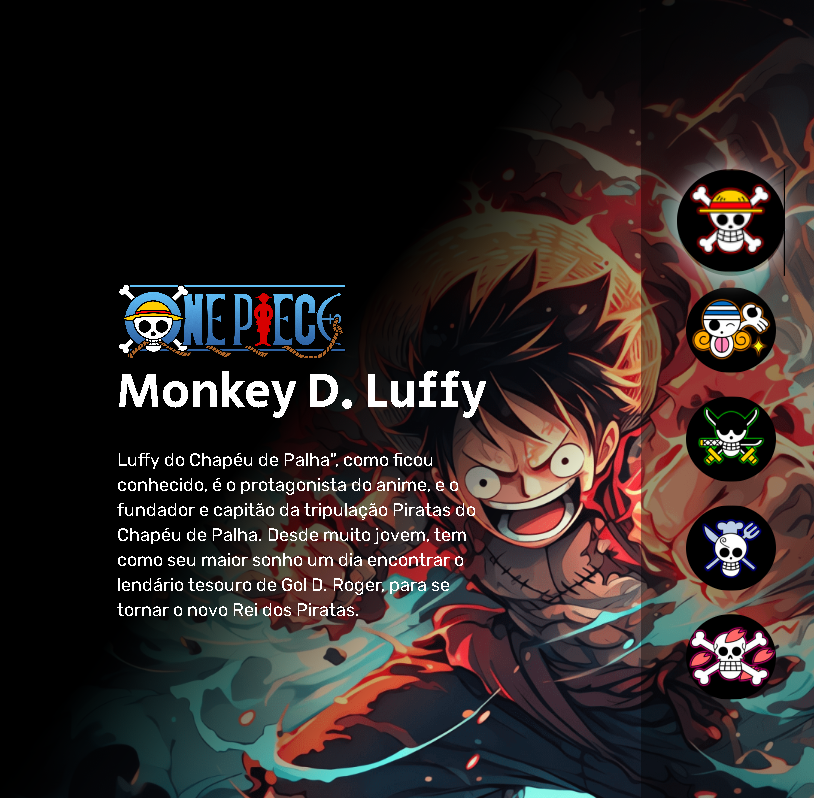

<h1 align="center">One Piece ☠</h1>

#### Esta página apresenta informações sobre alguns dos principais personagens do anime One Piece. Cada personagem é exibido em um cartão com uma imagem, nome e descrição. A página é responsiva e interativa, permitindo aos usuários alternar entre os diferentes personagens. É uma maneira fácil e agradável de aprender mais sobre os personagens de One Piece.

## Tecnologias utilizadas
- HTML
- CSS
- JavaScript
  
### Autor
<a href="https://avatars.githubusercontent.com/u/146045369?v=4">
 
  
</a>
 <h3>Lucas Noetzold</h3>
  
 <b>Entre em contato!</b>

